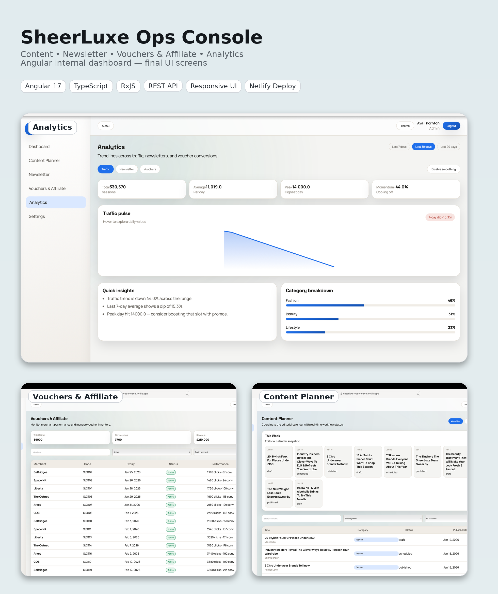

# SheerLuxe Content & Commerce Ops Console

A demo Angular 17+ internal dashboard for editorial + commerce teams to plan content, manage newsletters, and monitor affiliate/voucher performance.

## Product Showcase


## Tech Stack
- Angular 17 (Standalone Components, Router)
- TypeScript + RxJS + Signals
- SCSS + CSS variables (light/dark theme)
- Angular in-memory-web-api (mock REST)

## Features
- Auth flow with role-based routes (Admin / Editor / Commerce)
- Dashboard KPIs + activity feed + mini chart
- Content planner with calendar, filters, and rich detail view
- Newsletter builder, preview, analytics
- Vouchers & affiliate performance tracking
- Analytics with interactive charts, insights, and breakdowns
- Settings with theme + feature toggles

## Local Development
```bash
npm install
npm run start
```

## Tests
```bash
npm run test
```

## Deployment
Build:
```bash
npm run build
```

For SPA hosting, use:
- Netlify: `netlify.toml` (already included)
- Vercel: `vercel.json` (already included)

## Demo Login
Use any of these emails (password 6+ chars):
- admin@sheerluxe.com
- editor@sheerluxe.com
- commerce@sheerluxe.com
